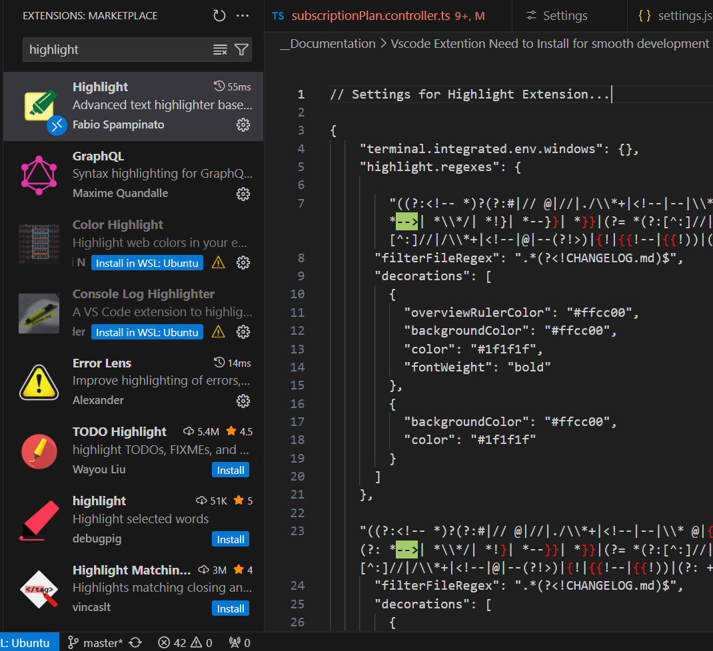

// Settings for Highlight Extension...

{
    "terminal.integrated.env.windows": {},
    "highlight.regexes": {
        
        "((?:<!-- *)?(?:#|// @|//|./\\*+|<!--|--|\\* @|{!|{{!--|{{!) *TODO(?:\\s*\\([^)]+\\))?:?)((?!\\w)(?: *-->| *\\*/| *!}| *--}}| *}}|(?= *(?:[^:]//|/\\*+|<!--|@|--|{!|{{!--|{{!))|(?: +[^\\n@]*?)(?= *(?:[^:]//|/\\*+|<!--|@|--(?!>)|{!|{{!--|{{!))|(?: +[^@\\n]+)?))": {
      "filterFileRegex": ".*(?<!CHANGELOG.md)$",
      "decorations": [
        {
          "overviewRulerColor": "#ffcc00",
          "backgroundColor": "#ffcc00",
          "color": "#1f1f1f",
          "fontWeight": "bold"
        },
        {
          "backgroundColor": "#ffcc00",
          "color": "#1f1f1f"
        }
      ]
    },

    "((?:<!-- *)?(?:#|// @|//|./\\*+|<!--|--|\\* @|{!|{{!--|{{!) *TODOChecked(?:\\s*\\([^)]+\\))?:?)((?!\\w)(?: *-->| *\\*/| *!}| *--}}| *}}|(?= *(?:[^:]//|/\\*+|<!--|@|--|{!|{{!--|{{!))|(?: +[^\\n@]*?)(?= *(?:[^:]//|/\\*+|<!--|@|--(?!>)|{!|{{!--|{{!))|(?: +[^@\\n]+)?))": {
      "filterFileRegex": ".*(?<!CHANGELOG.md)$",
      "decorations": [
        {
          "overviewRulerColor": "#ffcc00",
          "backgroundColor": "#ffcc00",
          "color": "#1f1f1f",
          "fontWeight": "bold"
        },
        {
          "backgroundColor": "#ffe47a",
          "color": "#1f1f1f"
        }
      ]
    },

    "((?:<!-- *)?(?:#|// @|//|./\\*+|<!--|--|\\* @|{!|{{!--|{{!) *(?:FIXME|FIXME |FIXME :|FIXME : |FIX : |FIX :|FIX|FIX: |BUG|UGLY)(?:\\s*\\([^)]+\\))?:?)((?!\\w)(?: *-->| *\\*/| *!}| *--}}| *}}|(?= *(?:[^:]//|/\\*+|<!--|@|--|{!|{{!--|{{!))|(?: +[^\\n@]*?)(?= *(?:[^:]//|/\\*+|<!--|@|--(?!>)|{!|{{!--|{{!))|(?: +[^@\\n]+)?))": {
      "filterFileRegex": ".*(?<!CHANGELOG.md)$",
      "decorations": [
        {
          "overviewRulerColor": "#cc0000",
          "backgroundColor": "#cc0000",
          "color": "#1f1f1f",
          "fontWeight": "bold"
        },
        {
          "backgroundColor": "#ffffff",
          "color": "#1f1f1f"
        }
      ]
    },

    "((?:<!-- *)?(?:#|// @|//|./\\*+|<!--|--|\\* @|{!|{{!--|{{!) *(?:FIXMEChecked|FIXChecked :)(?:\\s*\\([^)]+\\))?:?)((?!\\w)(?: *-->| *\\*/| *!}| *--}}| *}}|(?= *(?:[^:]//|/\\*+|<!--|@|--|{!|{{!--|{{!))|(?: +[^\\n@]*?)(?= *(?:[^:]//|/\\*+|<!--|@|--(?!>)|{!|{{!--|{{!))|(?: +[^@\\n]+)?))": {
      "filterFileRegex": ".*(?<!CHANGELOG.md)$",
      "decorations": [
        {
          "overviewRulerColor": "#cc0000",
          "backgroundColor": "#f67b7b",
          "color": "#1f1f1f",
          "fontWeight": "bold"
        },
        {
          "backgroundColor": "#ffffff",
          "color": "#1f1f1f"
        }
      ]
    },

    "((?:<!-- *)?(?:#|// @|//|./\\*+|<!--|--|\\* @|{!|{{!--|{{!) *(?:Idea|>)(?:\\s*\\([^)]+\\))?:?)((?!\\w)(?: *-->| *\\*/| *!}| *--}}| *}}|(?= *(?:[^:]//|/\\*+|<!--|@|--|{!|{{!--|{{!))|(?: +[^\\n@]*?)(?= *(?:[^:]//|/\\*+|<!--|@|--(?!>)|{!|{{!--|{{!))|(?: +[^@\\n]+)?))": {
      "filterFileRegex": ".*(?<!CHANGELOG.md)$",
      "decorations": [
        {
          "overviewRulerColor": "#cc0000",
          "backgroundColor": "#a1cb68",
          "color": "#000000",
          "fontWeight": "bold"
        },
        {
          "backgroundColor": "#ffffff",
          "color": "#1f1f1f"
        }
      ]
    },

    "((?:<!-- *)?(?:#|// @|//|./\\*+|<!--|--|\\* @|{!|{{!--|{{!) *(?:IdeaChecked)(?:\\s*\\([^)]+\\))?:?)((?!\\w)(?: *-->| *\\*/| *!}| *--}}| *}}|(?= *(?:[^:]//|/\\*+|<!--|@|--|{!|{{!--|{{!))|(?: +[^\\n@]*?)(?= *(?:[^:]//|/\\*+|<!--|@|--(?!>)|{!|{{!--|{{!))|(?: +[^@\\n]+)?))": {
      "filterFileRegex": ".*(?<!CHANGELOG.md)$",
      "decorations": [
        {
          "overviewRulerColor": "#cc0000",
          "backgroundColor": "#a1cb68",
          "color": "#000000",
          "fontWeight": "bold"
        },
        {
          "backgroundColor": "#a1cb68",
          "color": "#1f1f1f"
        }
      ]
    },

    "((?:<!-- *)?(?:#|// @|//|./\\*+|<!--|--|\\* @|{!|{{!--|{{!) *(?:Issue)(?:\\s*\\([^)]+\\))?:?)((?!\\w)(?: *-->| *\\*/| *!}| *--}}| *}}|(?= *(?:[^:]//|/\\*+|<!--|@|--|{!|{{!--|{{!))|(?: +[^\\n@]*?)(?= *(?:[^:]//|/\\*+|<!--|@|--(?!>)|{!|{{!--|{{!))|(?: +[^@\\n]+)?))": {
      "filterFileRegex": ".*(?<!CHANGELOG.md)$",
      "decorations": [
        {
          "overviewRulerColor": "#ff27a1",
          "backgroundColor": "#ff27a1",
          "color": "#1f1f1f",
          "fontWeight": "bold"
        },
        {
          "backgroundColor": "#ffffff",
          "color": "#1f1f1f"
        }
      ]
    },

    "((?:<!-- *)?(?:#|// @|//|./\\*+|<!--|--|\\* @|{!|{{!--|{{!) *(?:Info :)(?:\\s*\\([^)]+\\))?:?)((?!\\w)(?: *-->| *\\*/| *!}| *--}}| *}}|(?= *(?:[^:]//|/\\*+|<!--|@|--|{!|{{!--|{{!))|(?: +[^\\n@]*?)(?= *(?:[^:]//|/\\*+|<!--|@|--(?!>)|{!|{{!--|{{!))|(?: +[^@\\n]+)?))": {
      "filterFileRegex": ".*(?<!CHANGELOG.md)$",
      "decorations": [
        {
          "overviewRulerColor": "#ff27a1",
          "backgroundColor": "#0493368d",
          "color": "#ffffff",
          "fontWeight": "bold"
        },
        {
          "backgroundColor": "#0493368d",
          "color": "#ffffff"
        }
      ]
    },

    "((?:<!-- *)?(?:#|// @|//|./\\*+|<!--|--|\\* @|{!|{{!--|{{!) *(?:IssueChecked)(?:\\s*\\([^)]+\\))?:?)((?!\\w)(?: *-->| *\\*/| *!}| *--}}| *}}|(?= *(?:[^:]//|/\\*+|<!--|@|--|{!|{{!--|{{!))|(?: +[^\\n@]*?)(?= *(?:[^:]//|/\\*+|<!--|@|--(?!>)|{!|{{!--|{{!))|(?: +[^@\\n]+)?))": {
      "filterFileRegex": ".*(?<!CHANGELOG.md)$",
      "decorations": [
        {
          "overviewRulerColor": "#ff27a1",
          "backgroundColor": "#fd78c3",
          "color": "#1f1f1f",
          "fontWeight": "bold"
        },
        {
          "backgroundColor": "#ffffff",
          "color": "#1f1f1f"
        }
      ]
    }
    },
    "workbench.iconTheme": "vscode-icons",
    "console-ninja.featureSet": "Community",
    "security.allowedUNCHosts": [
      "wsl.localhost"
    ],
    "[javascriptreact]": {
      "editor.defaultFormatter": "esbenp.prettier-vscode"
    },
    "[css]": {
      "editor.defaultFormatter": "esbenp.prettier-vscode"
    },
    "editor.formatOnSave": true,
    "editor.formatOnSaveMode": "modifications",
    "editor.defaultFormatter": "dbaeumer.vscode-eslint",
    "editor.tabSize": 2,
    "workbench.editor.empty.hint": "hidden"
}